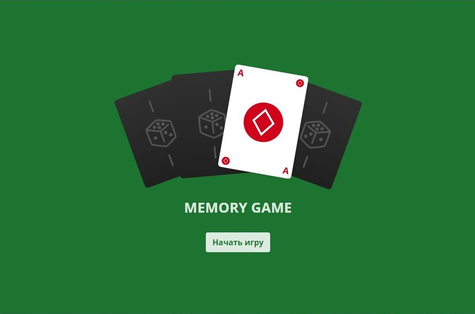
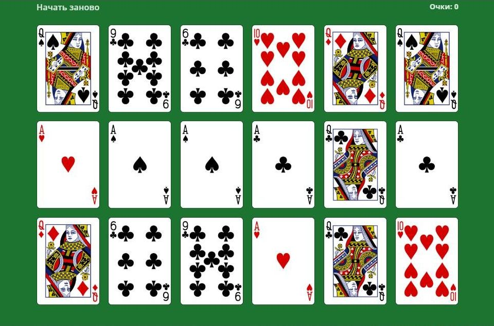
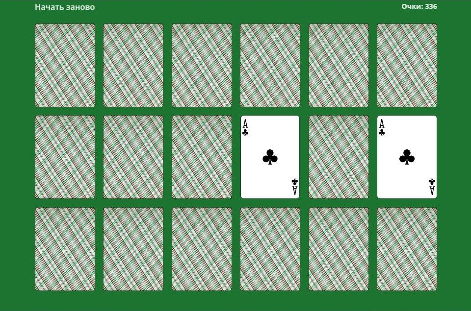
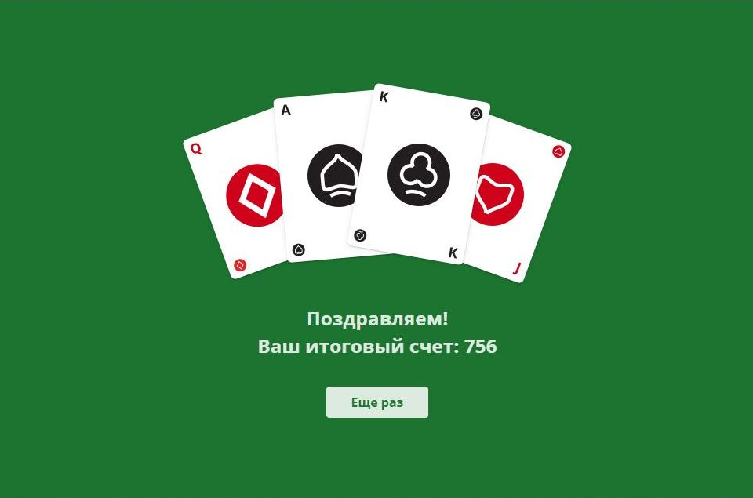

# Memory Game

"Memory Game" – это карточная настольная игра на одного. Игрок открывает любые две карты за один ход.
Если при открытии образовалась пара одинаковых по масти и номиналу карт, то они пропадают со стола, а игроку начисляются очки. Если открытые карты оказались разными, то они переворачивают обратно рубашкой вверх, а количество набранных очков уменьшается. 

Первый экран — стартовый:

При нажатии кнопки "Начать игру" на столе раскладываются 18 карт (6 на 3). Каждую новую игру генерируется новый случайный расклад с условием, что у каждой карты в раскладке обязательно должна быть пара. Первые 5 секунд карты лежат рубашкой вниз, потом переворачиваются рубашкой вверх.

Игрок кликает на любую карту, после чего она переворачивается и остается открытой, до тех пор, пока игрок не откроет вторую карту. Если карты составляют пару, они исчезают со стола. В обратном случае они снова переворачиваются рубашкой вверх.

Очки пересчитываются на каждом ходу по следующей формуле: 
— при образовании пары прибавляется число нераскрытых пар, умноженное на 42; 
— при несовпадении пары вычитается число раскрытых пар, умноженное на 42. 
Игра продолжается до тех пор, пока на столе есть карты. После исчезновения со стола последней пары, появляется экран с количеством заработанных очков:

